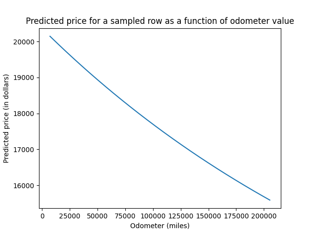
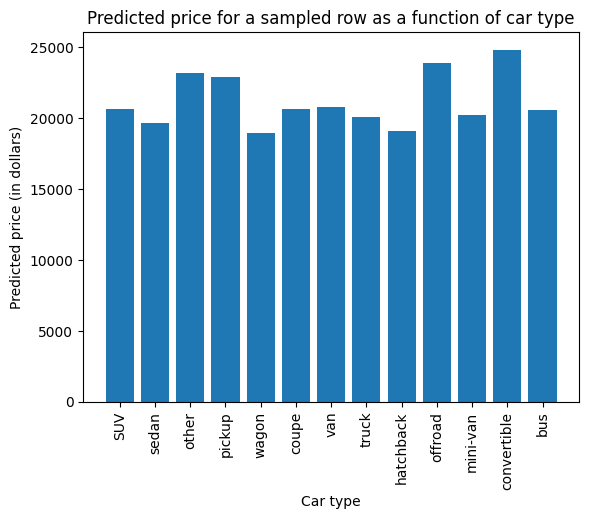
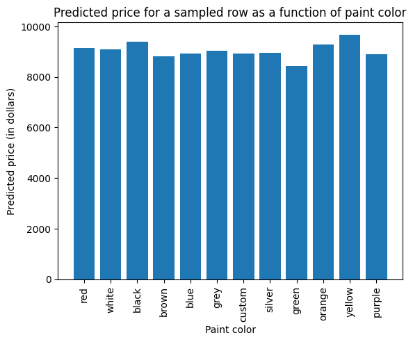

# Investigating how different factors influence used car prices

## Project objective

The goal of this project is to determine what factors influence the price of used cars. Our investigation uses a regression-based approach to model the behavior of used car prices as a function of these factors.

[Here is a link to the Jupyter notebook for this project.](<prompt_II.ipynb>)

## Data description

Our data, which comes from Kaggle dataset, can be found in the [data/vehicles.csv.zip](data/vehicles.csv.zip) file (the file is a compressed zip file).

Each data point corresponds to a sold used car. The data points contain the selling price, as well as the year and model of the car, total miles on the odometer, and state and city where the car was sold. Much of the data contains additional information about the car such as paint color, drive type, fuel type, transmission, condition of the car, etc.

## Findings

Below are some plots showing how used car prices varied for some different parameters.

- Odometer miles:
\

\
From the graph, we see that predicted price decreases steadily with odometer miles. Therefore we suggest preferring used cars with low odometer values.

- Car type:
\

\
From the graph, we see that pickups, offroad vehicles, and (especially) convertibles get higher prices. Therefore, we suggest focusing on carrying thesee in inventory.

- Car paint color:
\

\
From the graph, we see that black and yellow cars have higher prices, whereas green cars have lower prices, on average. Therefore, we suggest preferring black and yellow cars, and avoiding green cars, in inventory.

<!--

### Findings for cheaper (under $20 per person) restaurant coupons

Below are some plots showing how acceptance rates of the coupons varied for some different parameters.

- Time of day:
\
CouponAcceptanceRateByTimeOfDay.png)
\
From the graph, we see people are not as likely to accept the coupon at early morning (7AM) and late night (10PM),
and are reasonably likely to accept the coupon at less-early morning (10AM),
but are very likely to accept the coupon in the afternoon and evening (2PM, 6PM).

- Age group:
\
CouponAcceptanceRateByAgeGroup.png)
\
From the graph, we see that there is not a lot of variance (only up to ~ 11 percentage points), but drivers age 25 and under seem most consistent in being more likely to accept the coupon.

- Passenger type
\
CouponAcceptanceRateByPassenger.png)
\
From the graph, we see the driver is more likely to accept the coupon when they are not alone, and even more likely to accept when the other passengers are not kids.

- Expiry time
\
CouponAcceptanceRateByExpiry.png)
\
From the graph, we see that there is a clear increase (by nearly 25 percentage points) in acceptance rates when the expiry is 1 day instead of 2 hours.

### Findings for bar coupons

- In total, about 41% of the bar coupons were accepted.

- Among those who went to bars 3 or fewer times a month, 37% of the bar coupons were accepted.
Among those who went to bars more than 3 times a month, 76% of the bar coupons were accepted.

- The bar coupon acceptance rate among drivers who go to a bar more than once a month and are over the age of 25 was 69%.
The bar coupon acceptance rate among all other drivers was 34%.

- The bar coupon acceptance rate among drivers who go to bars more than once a month and had passengers that were not a kid and had occupations other than farming, fishing, or forestry was 71%.
The bar coupon acceptance rate among all other drivers was 38%.

- The bar coupon acceptance rate among drivers who:
  - go to bars more than once a month, had passengers that were not a kid, and were not widowed, was 67%.
  - go to bars more than once a month and are under the age of 30 was 72%.
  - go to cheap restaurants more than 4 times a month and income is less than 50K was 46%.

## Recommendations

### Recommendations for cheaper (under $20 per person) restaurant coupons

We suggest: 

- focusing on a time range such as 1PM-7PM to maximize coupon acceptance, or possibly 9AM-7PM.
- targeting the under-25 age group.
- targeting drivers who are not alone, and especially drivers with other adult passengers.
- using coupons with the expiry time of 1 day instead of 2 hours.

### Recommendations for bar coupons

We suggest targeting drivers who visit bars more frequently, and who are in their 20s.

-->
